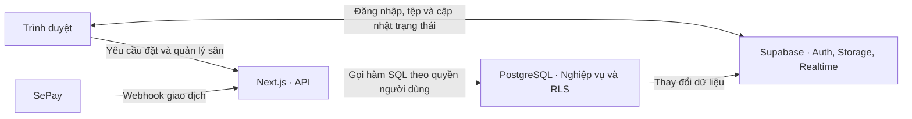

<p align="center">
  
</p>

# Sân Ngon

**Tìm giờ còn sân. Đặt chỗ trực tuyến. Quản lý lịch tập trung.**

Website kết nối người chơi và chủ sân thể thao tại Hà Nội, hỗ trợ **bóng đá, cầu lông và pickleball**. Người chơi chọn thời gian, xem sân còn trống và thanh toán qua chuyển khoản. Chủ sân quản lý sân, bảng giá, lịch đặt và các khoản cần hoàn trong cùng một nơi.

[Truy cập website](https://san-ngon.vercel.app) · [Hướng dẫn thiết lập](docs/dev-setup.md) · [Tài liệu thuyết trình](docs/thuyet-trinh-ky-thuat-de-hieu.md)

Sân Ngon được phát triển dưới dạng MVP cho đồ án khởi nghiệp, với bản demo ngày **28/09/2026**. Giao diện ưu tiên trải nghiệm trên máy tính và thích ứng với điện thoại. Kiến trúc hướng tới một nhóm phát triển nhỏ: tập trung vào luồng đặt sân, tính đúng của giao dịch và khả năng vận hành.

## Trải nghiệm sản phẩm

| Người sử dụng | Chức năng |
| --- | --- |
| **Người chơi** | Tìm sân theo khu vực, môn và ngày chơi; xem ảnh thật; chọn giờ còn sân; đặt và thanh toán; theo dõi, hủy đơn; quản lý hồ sơ và ảnh đại diện |
| **Chủ sân** | Đăng ký xác minh; kết nối tài khoản nhận tiền; quản lý cụm sân, sân con và ảnh; đặt giá theo ngày/giờ; khóa lịch; theo dõi đơn, thống kê và hoàn cọc |
| **Quản trị viên** | Duyệt hồ sơ chủ sân, xem giấy tờ riêng tư, quản lý tài khoản và thiết lập phí dịch vụ |

### Từ tìm sân đến xác nhận đặt chỗ

1. **Tìm địa điểm phù hợp.** Lọc theo tên/địa chỉ, khu vực, môn, ngày chơi, trong/ngoài nhà và tình trạng còn chỗ. Kết quả có giá từ, thông tin khung trống, sắp xếp và phân trang.
2. **Chọn giờ chơi.** Chọn môn và thời lượng để xem các giờ còn sân của cả cụm. Hệ thống gợi ý sân trống liên tục trong khoảng đã chọn, ưu tiên tổng giá thấp nhất và cho đổi sân trước khi xác nhận.
3. **Tạo đơn.** Đăng nhập bằng Google hoặc email/mật khẩu; đăng ký email có xác nhận OTP. Hệ thống kiểm tra lịch, tính lại giá và giữ chỗ **15 phút**.
4. **Chuyển khoản.** QR hiển thị số tiền, tài khoản nhận và mã đơn. Đơn mới thanh toán trước **100% tiền sân**; hệ thống đối chiếu thông báo từ SePay trước khi xác nhận.
5. **Theo dõi và quản lý.** Checkout và danh sách đơn cập nhật qua realtime, đồng bộ lại khi kết nối trở lại hoặc quay về tab. Người chơi xem đơn, hủy theo chính sách và nhận thông báo trên website.

### Từ đăng ký chủ sân đến công khai địa điểm

**Thông tin đại diện → Giấy tờ → Kết nối SePay → Duyệt tài khoản → Tạo cụm sân → Bổ sung ảnh thật.**

Hồ sơ được lưu trước khi chuyển sang SePay cấp quyền, nên người đăng ký có thể quay lại hoàn thành bước kết nối mà không mất giấy tờ. Kết nối thanh toán không tự duyệt tài khoản; quản trị viên vẫn kiểm tra hồ sơ trước khi chủ sân được tạo cụm.

Cụm mới ở trạng thái nháp. Lưu **3–8 ảnh thật** sẽ công khai cụm, không cần thêm một vòng duyệt từng địa điểm. Việc nhận đơn còn phụ thuộc điều kiện thanh toán, phí dịch vụ và phạm vi vận hành đang được mở.

Chủ sân có lịch vận hành, bảng giá theo ngày/giờ, khóa/mở khung giờ, danh sách đơn và thống kê. Có thể xác nhận cọc thủ công cho đơn còn hạn sau khi kiểm tra tiền vào; các khoản hoàn được theo dõi và đánh dấu sau khi chuyển hoàn thực tế. Telegram báo đơn mới khi chủ sân đã kết nối bot.

## Những quyết định kỹ thuật chính

| Bài toán | Cách Sân Ngon xử lý |
| --- | --- |
| Hai người đặt cùng một sân, cùng giờ | Ràng buộc loại trừ **GiST trong PostgreSQL** chặn thời gian chồng lấn ngay khi ghi đơn |
| Giá hiển thị bị sửa ở trình duyệt | Hàm SQL tra bảng giá, tính tiền và lưu giá vào đơn; API không nhận số tiền do khách quyết định |
| Giữ chỗ nhưng không thanh toán | Đơn chờ hết hạn sau 15 phút; SQL giải phóng giữ chỗ hết hạn trước khi tạo đơn mới |
| Webhook bị gửi lại | Kiểm tra mã giao dịch để tránh ghi nhận thanh toán trùng |
| Thay đổi tài khoản nhận tiền | Lưu bản chụp thông tin người nhận vào từng đơn; đơn cũ giữ nguyên người nhận |
| Người dùng truy cập dữ liệu của nhau | Supabase Auth, RLS và các hàm SQL kiểm tra vai trò, quyền sở hữu |
| Sai lệch giờ giữa các thiết bị | Lưu thời gian UTC, xử lý quy đổi sang giờ Việt Nam trong SQL; giao diện chỉ định dạng |

Một cụm sân có thể chứa nhiều sân thuộc các môn khác nhau. **Mỗi đơn gắn với đúng một sân con**; cùng giờ vẫn có thể đặt các sân khác nhau. Mỗi tài khoản có tối đa hai đơn chờ còn hạn. Thời hạn đặt trước mặc định 30 ngày, cấu hình theo cụm trong khoảng 1–180 ngày.

## Kiến trúc



**Nghiệp vụ nằm trong PostgreSQL:** tính giá, kiểm tra lịch, tạo/hủy đơn và xác nhận thanh toán. Next.js xác thực người dùng, kiểm tra đầu vào, gọi hàm SQL và chuyển lỗi thành thông báo tiếng Việt. Dự án gọi Supabase/RPC trực tiếp, không dùng ORM.

Giấy tờ chủ sân nằm trong bucket riêng tư; quản trị viên đọc qua liên kết có thời hạn. Ảnh sân nằm trong bucket công khai riêng. Token và khóa webhook SePay được mã hóa AES-256-GCM khi lưu. Client có quyền service role chỉ dùng trong các route tích hợp SePay và webhook SePay; trang admin dùng phiên người dùng với RPC kiểm tra quyền.

| Thành phần | Công nghệ |
| --- | --- |
| Website và API | Next.js 15 App Router, React 19, TypeScript |
| Giao diện | Tailwind CSS v4, Bricolage Grotesque, Be Vietnam Pro |
| Dữ liệu và dịch vụ nền | Supabase: PostgreSQL, Auth, Realtime, Storage |
| Thanh toán | SePay OAuth, QR chuyển khoản, webhook xác nhận giao dịch |
| Thông báo | Thông báo trong website, Telegram; email qua Resend khi được cấu hình |
| Môi trường chạy | Node.js 24.x, Vercel; Supabase từ xa, ưu tiên region Singapore |

## Thanh toán và phí dịch vụ

### Tiền đặt sân

SePay đã cấp OAuth; chủ sân kết nối tại bước cuối của `/dang-ky-san` hoặc quản lý kết nối tại `/chu-san/thanh-toan`. Một chủ sân sử dụng một tài khoản nhận cọc cho tất cả cụm sân. Hệ thống lưu kết nối, ngân hàng, số tài khoản và tên người nhận vào đơn để tạo QR và đối soát.

Webhook dùng API key để xác thực. Hệ thống kiểm tra mã đơn `SANxxxxxx`, người nhận, số tiền và mã giao dịch trước khi xác nhận. Chuyển thiếu không xác nhận đơn; tiền đến sau khi đơn hết hạn không khôi phục lịch mà được ghi nhận để xử lý hoàn. Checkout nhận thay đổi qua realtime, không polling trạng thái thanh toán. Lịch chọn sân có thêm tải lại định kỳ và khi quay lại tab.

**Phạm vi demo mặc định chỉ mở nhận đơn cho một chủ sân.** Kết nối OAuth đã có trong code; cờ `multi_owner_enabled` chỉ được bật sau khi nghiệm thu OAuth, QR và chuyển khoản thật. Chủ sân demo tiếp tục dùng cấu hình cũ cho đến khi hoàn tất kết nối OAuth; webhook cũ được giữ để đối soát các đơn cũ. Xem [hướng dẫn SePay hiện hành](docs/sepay-single-owner.md) để cấu hình và chuyển đổi.

Hoàn tiền thực hiện thủ công. Chính sách hiện dùng mốc hủy trước giờ chơi từ **hai giờ** trở lên để xét hoàn cọc; mốc này còn chờ thống nhất với chủ sân. Chủ sân hủy đơn của khách thì khách được hoàn. Về trang chủ hoặc đóng checkout không hủy giữ chỗ; nút hủy giúp trả lịch ngay.

### Phí sử dụng website

Mặc định chủ sân được miễn phí. Quản trị viên có thể bật mức **299.000đ/tháng/chủ sân**, áp dụng cho toàn bộ cụm sân của tài khoản đó. Chủ sân thanh toán tại `/chu-san/phi-dich-vu` với mã `PHIxxxxxxxx`, tách biệt với tiền đặt sân.

SePay xác nhận khoản phí hợp lệ để gia hạn; gửi lại giao dịch không gia hạn lặp. Khi phí hết hạn, hệ thống chặn đăng sân và nhận đơn mới nhưng vẫn cho xử lý đơn cũ. Chi tiết tại [tài liệu phí dịch vụ](docs/owner-subscriptions.md).

## Chạy dự án

Cần **Node.js 24.x**, npm và một project **Supabase từ xa**. Docker không bắt buộc.

```bash
git clone https://github.com/MinhTT2/san-ngon.git
cd san-ngon
npm ci
cp .env.example .env.local
```

Điền `NEXT_PUBLIC_SUPABASE_URL` và `NEXT_PUBLIC_SUPABASE_ANON_KEY` vào `.env.local`, rồi kiểm tra cấu hình:

```bash
npm run setup:check
```

Với project Supabase mới, hoàn tất database, Auth, Storage và realtime theo [hướng dẫn thiết lập](docs/dev-setup.md) trước khi thử luồng đặt sân. **`supabase/migrations/` là nguồn schema và hàm hiện tại**; không dùng bộ SQL đánh số cũ hoặc seed cũ để thay thế migrations.

```bash
npm run dev
```

Mở **http://localhost:3000**. Hai biến Supabase chỉ cung cấp kết nối cơ bản; OAuth, webhook, email và Telegram cần cấu hình tương ứng trong [.env.example](.env.example). Phần thanh toán dùng [hướng dẫn SePay hiện hành](docs/sepay-single-owner.md), bao gồm các biến OAuth và cách giữ kết nối cũ. `setup:check` hỗ trợ kiểm tra biến môi trường, không thay thế nghiệm thu tích hợp.

### Kiểm tra chất lượng

```bash
npm run ci
```

Lệnh chạy **ESLint → TypeScript → production build**, cũng được thực thi trong GitHub Actions khi push `main` hoặc mở pull request.

Repo có các script kiểm tra riêng trong [`scripts/`](scripts/) cho giữ chỗ, bảng giá, quyền truy cập, SePay, phí dịch vụ và giao diện. Các script SQL tạo dữ liệu thử trong transaction rồi rollback; chúng không tự chạy trong `npm run ci`. Luồng trên trình duyệt, email và chuyển khoản thật cần nghiệm thu theo [checklist MVP](docs/mvp-acceptance.md).

## Cấu trúc mã nguồn

```text
app/
  (site)/               Trang công khai, tìm sân, tài khoản, đơn người chơi
  (owner)/              Quản lý sân, lịch, giá, kết nối thanh toán và phí
  admin/                Duyệt hồ sơ, quản lý tài khoản và phí dịch vụ
  dat-san/[code]/       Checkout và theo dõi thanh toán
  api/                  Xác thực đầu vào, gọi RPC và tích hợp dịch vụ
  auth/                 Callback đăng nhập và đăng xuất
components/             Thành phần giao diện dùng chung
lib/                    Kiểu dữ liệu, Supabase client và các tiện ích
supabase/migrations/    Schema, RLS và hàm nghiệp vụ theo phiên bản
scripts/                Kiểm tra và hỗ trợ vận hành
docs/                   Hướng dẫn thiết lập, nghiệm thu và thuyết trình
```

<details>
<summary><strong>Các đường dẫn chính</strong></summary>

| Đường dẫn | Chức năng |
| --- | --- |
| `/`, `/tim-san`, `/san/[slug]` | Trang chủ, tìm sân, ảnh và chọn giờ |
| `/dang-nhap`, `/dang-ky`, `/quen-mat-khau` | Đăng nhập, đăng ký, khôi phục mật khẩu |
| `/tai-khoan` | Họ tên, số điện thoại và ảnh đại diện |
| `/dat-san/[code]` | Thanh toán và trạng thái giữ chỗ |
| `/don-cua-toi`, `/thong-bao` | Đơn và thông báo người chơi |
| `/dang-ky-san` | Hồ sơ xác minh chủ sân và kết nối SePay |
| `/chu-san` | Tổng quan, thống kê và khoản cần hoàn |
| `/chu-san/quan-ly`, `/tao-cum-san` | Quản lý cụm, sân con và ảnh |
| `/chu-san/lich`, `/chu-san/don` | Lịch vận hành và danh sách đơn |
| `/chu-san/bang-gia/[id]` | Giá theo ngày và khung giờ |
| `/chu-san/thanh-toan`, `/chu-san/phi-dich-vu` | Kết nối SePay và thanh toán phí website |
| `/admin`, `/admin/owners/[id]`, `/admin/users` | Duyệt hồ sơ và quản lý tài khoản |
| `/admin/phi-dich-vu` | Bật/tắt thu phí và theo dõi phí chủ sân |
| `/chinh-sach-huy`, `/lien-he` | Chính sách và hỗ trợ |

</details>

## Phạm vi và nghiệm thu

Luồng hiện có bao gồm xác minh chủ sân, quản lý sân và ảnh thật, bảng giá, khóa lịch, đặt sân, thanh toán, hủy/hoàn, thống kê, hồ sơ cá nhân và phí dịch vụ. Trước khi mở vận hành rộng, cần hoàn tất nghiệm thu chuyển khoản thật, cấu hình gửi email và thống nhất quy trình hoàn tiền. Có chức năng trong mã nguồn không đồng nghĩa dịch vụ bên ngoài đã được cấu hình và kiểm tra trên môi trường triển khai.

Bản đồ, đánh giá sao, tìm đối ghép kèo, ví nội bộ, hoàn tiền tự động, Zalo OA, email thông báo đơn cho người chơi và ứng dụng native nằm ngoài MVP. Email xác thực tài khoản vẫn thuộc phạm vi sản phẩm.

## Tài liệu

| Tài liệu | Dành cho |
| --- | --- |
| [Thuyết trình kỹ thuật dễ hiểu](docs/thuyet-trinh-ky-thuat-de-hieu.md) | Người giới thiệu sản phẩm, có bài nói mẫu và câu hỏi thường gặp |
| [Thiết lập và vận hành](docs/dev-setup.md) | Người dựng môi trường, cấu hình Auth/database và triển khai |
| [SePay: cấu hình, OAuth và nghiệm thu](docs/sepay-single-owner.md) | Người thiết lập và đối soát thanh toán |
| [Phí dịch vụ chủ sân](docs/owner-subscriptions.md) | Người vận hành tính năng thu phí tháng |
| [Checklist nghiệm thu MVP](docs/mvp-acceptance.md) | Người kiểm tra luồng thực tế trước khi đưa vào sử dụng |
| [Nguyên tắc phát triển](AGENTS.md) | Người tiếp tục phát triển hoặc bảo trì dự án |
